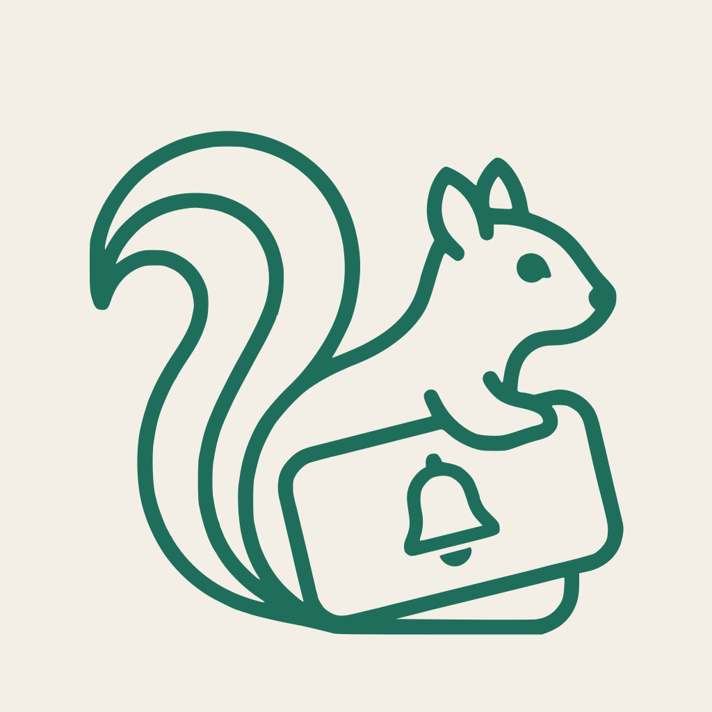
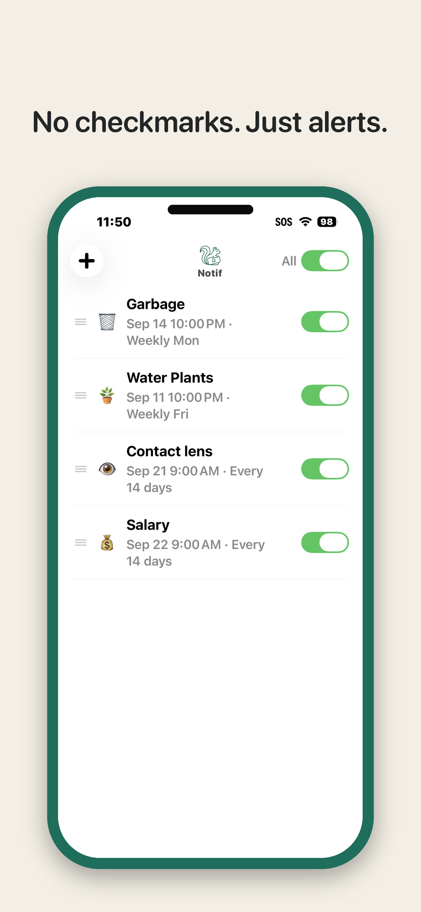
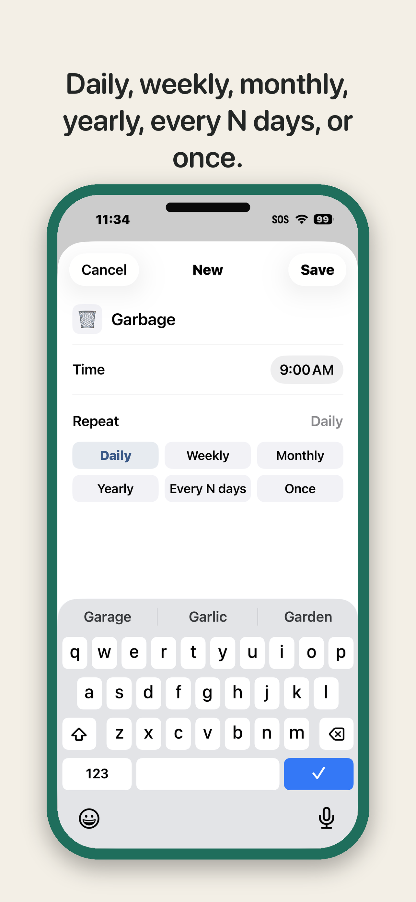
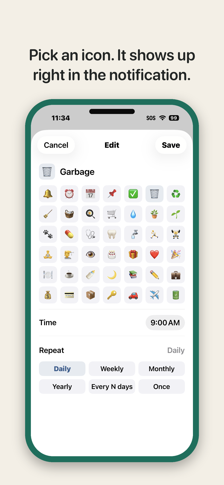
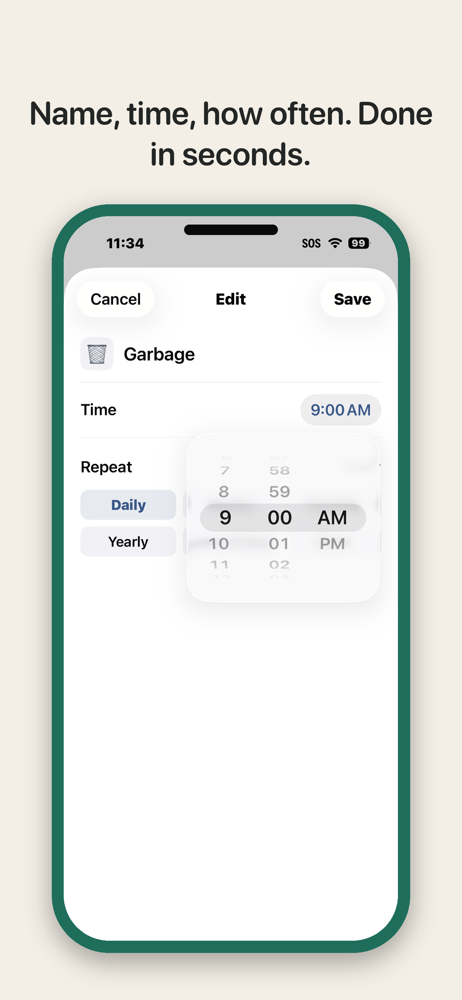
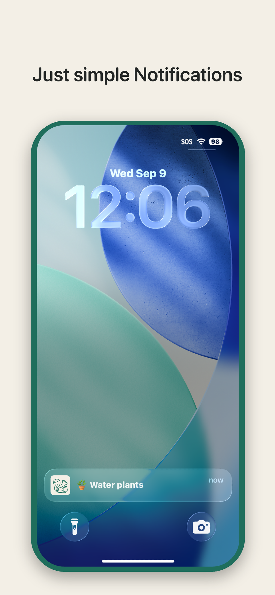

# Notif Support

Notif is a minimal recurring-reminder app for iOS. Set a name, a time, and how often — Notif keeps reminding you on schedule, with no checkmark or completion step required.

## Screenshots

## Frequently asked questions

**Why doesn't my reminder disappear after it fires?**
Recurring reminders (Daily, Weekly, Monthly, Yearly, Every N days) are meant to keep firing indefinitely — there's no "done" state. Only a **Once** reminder removes itself automatically after it fires.

**Does Notif need an account or internet connection?**
No. Notif works fully offline and does not require sign-in. See the [Privacy Policy](privacy.html) for details.

**Notifications aren't arriving.**
Check Settings → Notifications → Notif and make sure notifications are allowed. Also confirm the reminder's toggle (and the "All" toggle) is on within the app.

## Contact

For bug reports or feature requests, contact: [tenack11.2@gmail.com](mailto:tenack11.2@gmail.com)
